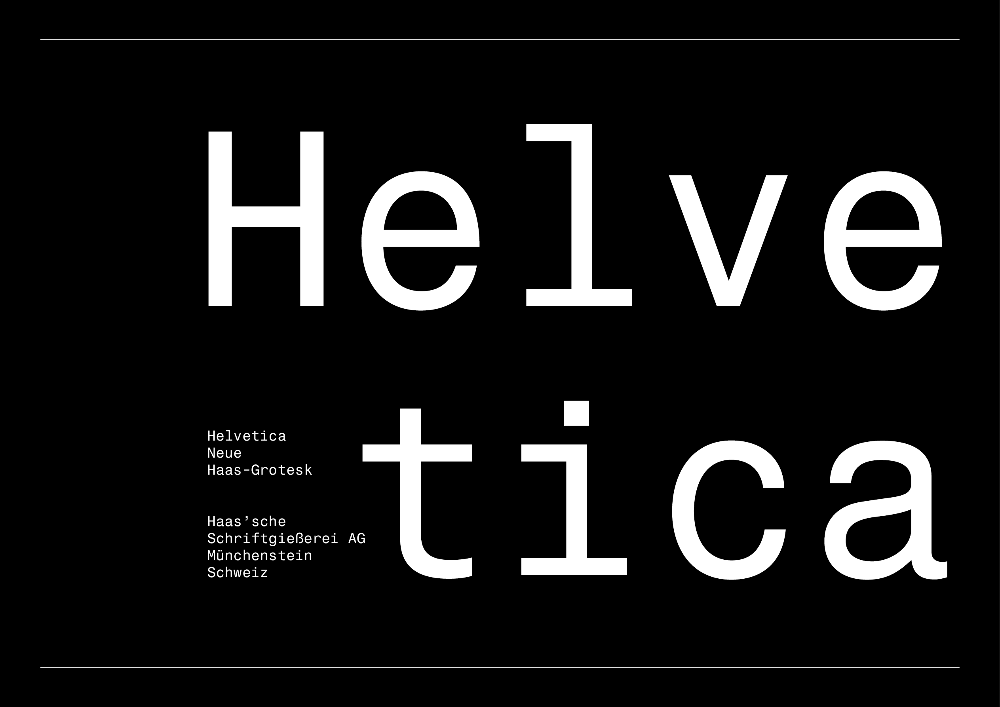
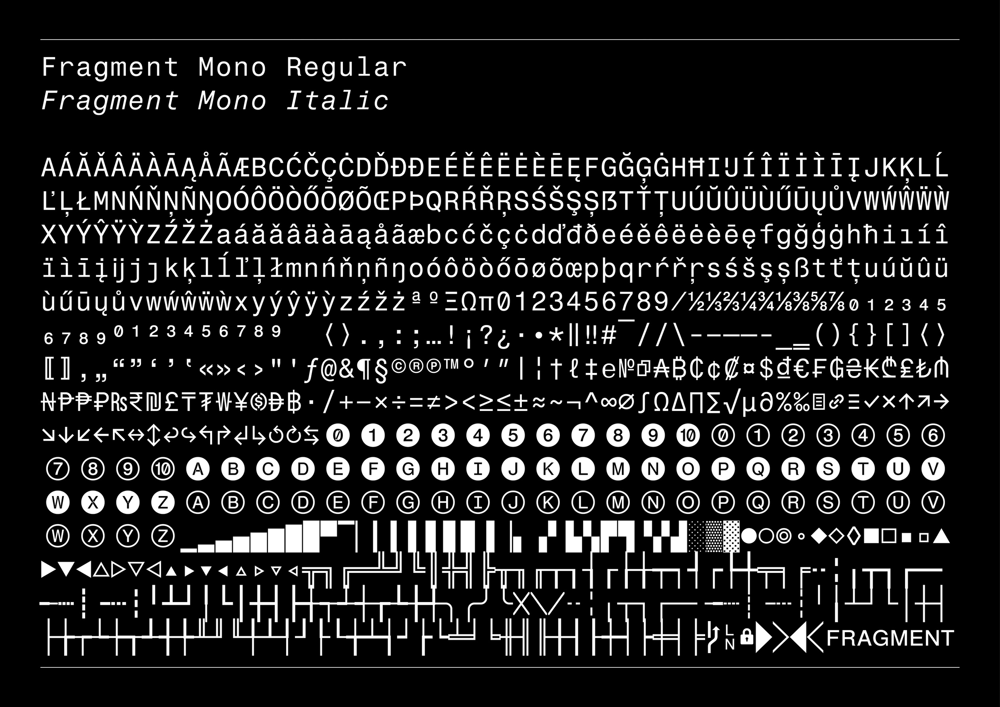
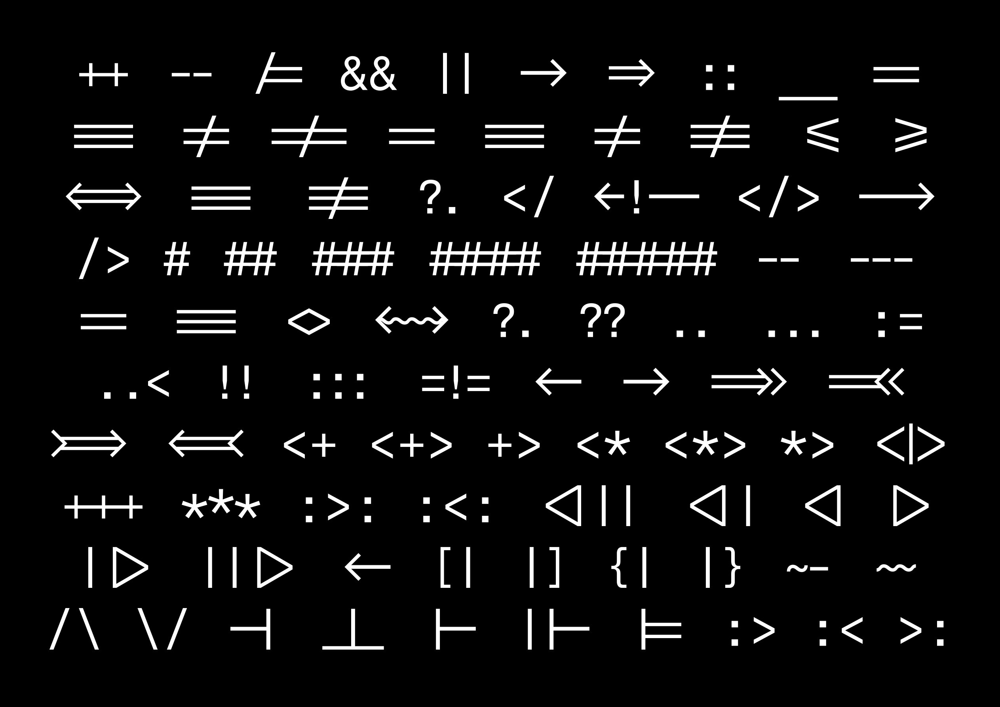
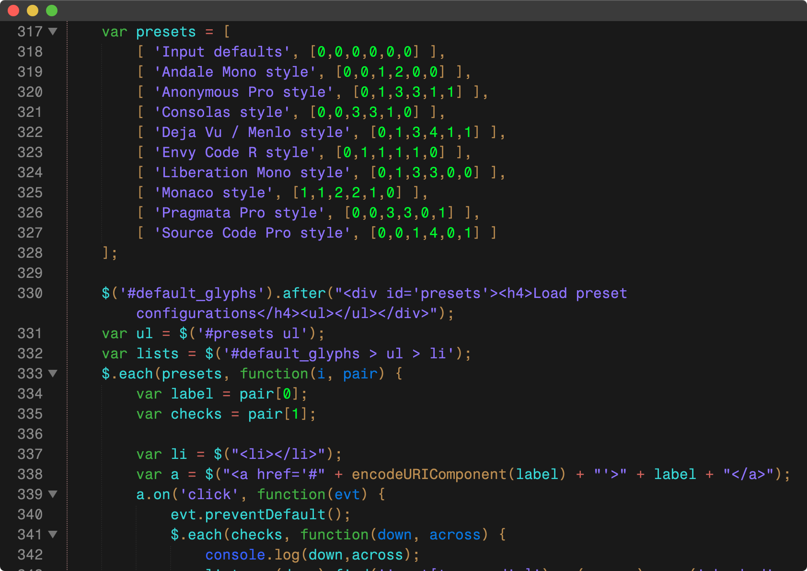
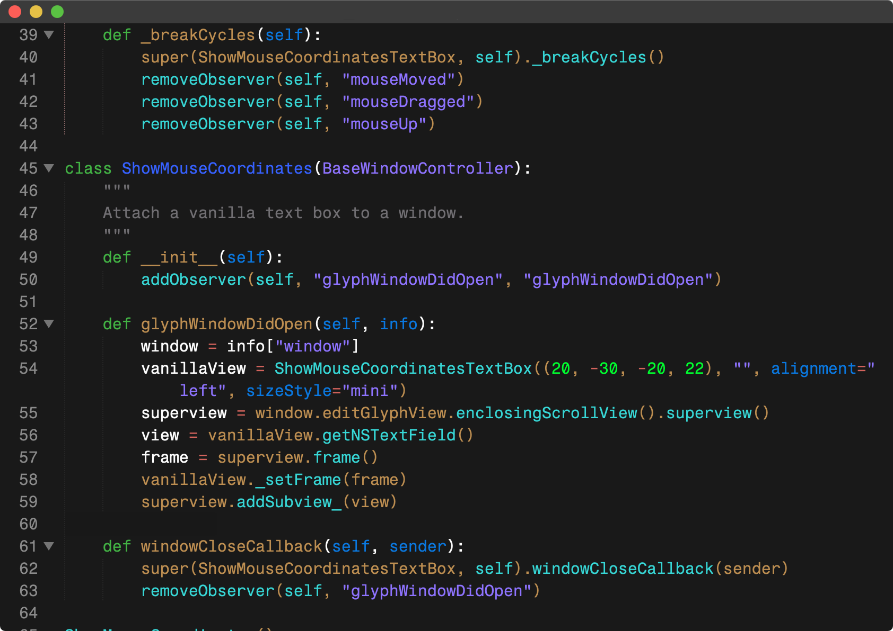
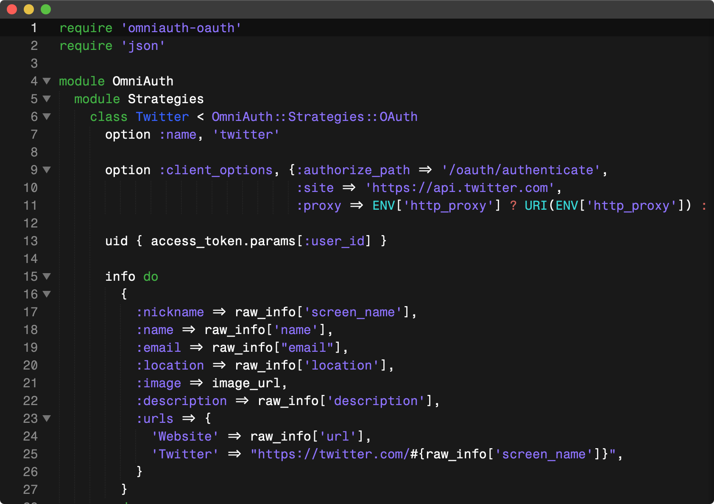
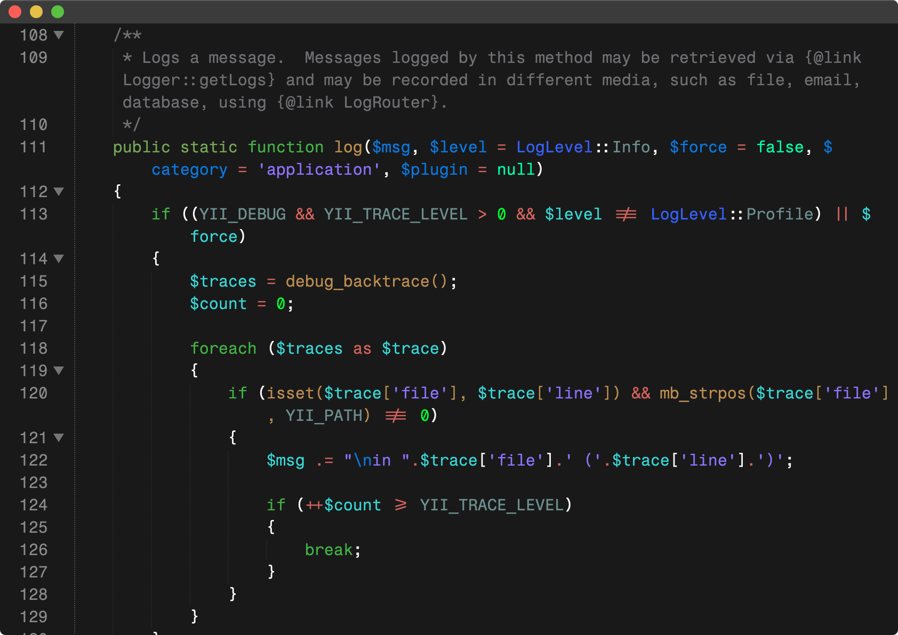

# Fragment Mono

[![][Fontbakery]](https://weiweihuanghuang.github.io/fragment-mono/fontbakery/fontbakery-report.html)
[![][Universal]](https://weiweihuanghuang.github.io/fragment-mono/fontbakery/fontbakery-report.html)
[![][GF Profile]](https://weiweihuanghuang.github.io/fragment-mono/fontbakery/fontbakery-report.html)
[![][Shaping]](https://weiweihuanghuang.github.io/fragment-mono/fontbakery/fontbakery-report.html)

[Fontbakery]: https://img.shields.io/endpoint?url=https%3A%2F%2Fraw.githubusercontent.com%2Fweiweihuanghuang%2Ffragment-mono%2Fgh-pages%2Fbadges%2Foverall.json
[GF Profile]: https://img.shields.io/endpoint?url=https%3A%2F%2Fraw.githubusercontent.com%2Fweiweihuanghuang%2Ffragment-mono%2Fgh-pages%2Fbadges%2FGoogleFonts.json
[Outline Correctness]: https://img.shields.io/endpoint?url=https%3A%2F%2Fraw.githubusercontent.com%2Fweiweihuanghuang%2Ffragment-mono%2Fgh-pages%2Fbadges%2FOutlineCorrectnessChecks.json
[Shaping]: https://img.shields.io/endpoint?url=https%3A%2F%2Fraw.githubusercontent.com%2Fweiweihuanghuang%2Ffragment-mono%2Fgh-pages%2Fbadges%2FShapingChecks.json
[Universal]: https://img.shields.io/endpoint?url=https%3A%2F%2Fraw.githubusercontent.com%2Fweiweihuanghuang%2Ffragment-mono%2Fgh-pages%2Fbadges%2FUniversal.json

Fragment Mono is a monospaced coding version of Helvetica created by modifying and extending [Nimbus Sans](https://github.com/twardoch/urw-core35-fonts) by URW Design Studio. 

## About

Fragment Mono was designed with direction by [Studio Lin](https://studiolin.org/) and comissioned by [Fragment](https://fragment.dev).

Download a specimen [here](documentation/FragmentMonoSpecimenDocumentation.pdf).

- Coding ligatures has been added based on [JetBrains Mono](https://github.com/JetBrains/JetBrainsMono) and [Fira Code](https://github.com/tonsky/FiraCode).
- Character set has been extended to include up to [GF Latin Plus](https://github.com/googlefonts/glyphsets/tree/main/GF_glyphsets/Latin).
- Small caps have been added.
- Cap height has been reduced to 96% for slightly better line-fitting.
- Drawing quality has been cleaned up and improved.
- Spacing has been matched to SF Mono.

### Coding Ligatures

### Javascript

### Python

### Ruby

### PHP

## Building

Fonts are built automatically by GitHub Actions - take a look in the "Actions" tab for the latest build.

If you want to build fonts manually on your own computer:

* `make build` will produce font files.
* `make test` will run [FontBakery](https://github.com/googlefonts/fontbakery)'s quality assurance tests.
* `make proof` will generate HTML proof files.

The proof files and QA tests are also available automatically via GitHub Actions - look at https://weiweihuanghuang.github.io/fragment-mono.

## Changelog

**30 September 2022. Version 1.00**

- Modified Nimbus Sans into monospaced.
- Corrected and improved drawings.
- Updated character set to [GF Latin Plus](https://github.com/googlefonts/glyphsets/tree/main/GF_glyphsets/Latin).
- Added small caps.
- Added coding ligatures based on [JetBrains Mono](https://github.com/JetBrains/JetBrainsMono) and [Fira Code](https://github.com/tonsky/FiraCode).
- Added some icons.
- Added more currency glyphs.

## License

This Font Software is licensed under the SIL Open Font License, Version 1.1.
This license is available with a FAQ at
https://scripts.sil.org/OFL

## Repository Layout

This font repository structure is inspired by [Unified Font Repository v0.3](https://github.com/unified-font-repository/Unified-Font-Repository), modified for the Google Fonts workflow.